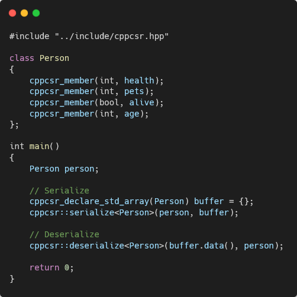

# cpp-class-serializer
A C++ header only library for serializing and deserializing C++ classes into a binary format with metadata that's mostly resilient to class changes.

# Usage
* Include [cppcsr.hpp](include/cppcsr.hpp)
* Declare member variables that you want to have a serializable metadata using the `cppcsr_member` macro.
* Use the `cppcsr_declare_std_array` to automaticlly create an **std::array** buffer to hold the serialized class

# Example
* [main.cpp](example/main.cpp)

# Note / Disclaimer
* Only supports raw data types (No string pointers, classes/structs, std containers, etc...)
* This was mainly made as a Proof of concept, so it might not be as good as a "reliable" library. If you're looking for one check out [cereal](https://uscilab.github.io/cereal/).